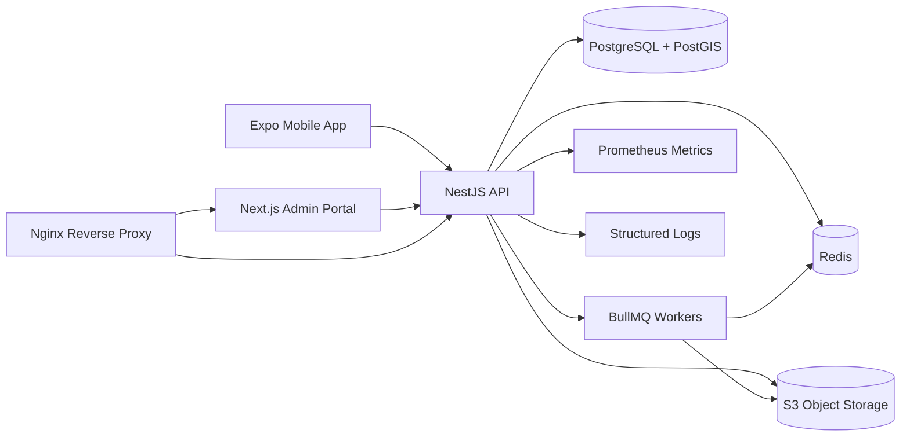
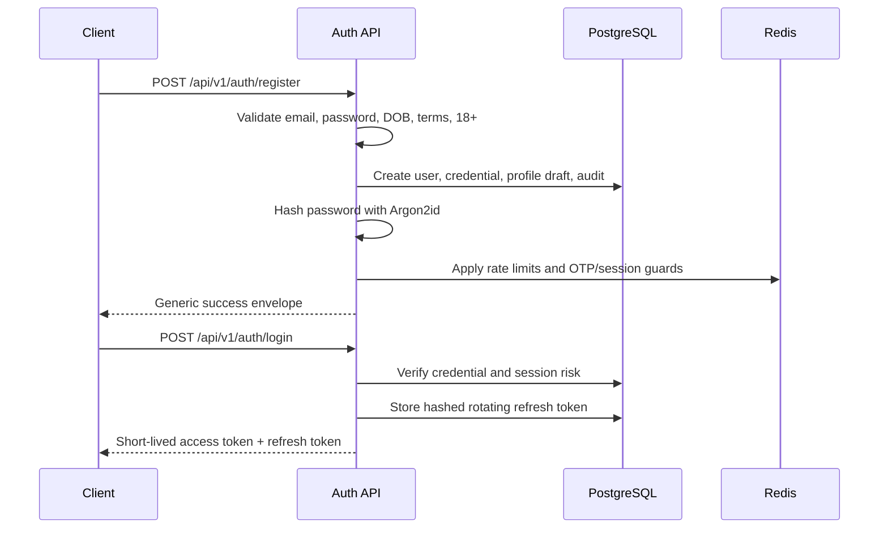
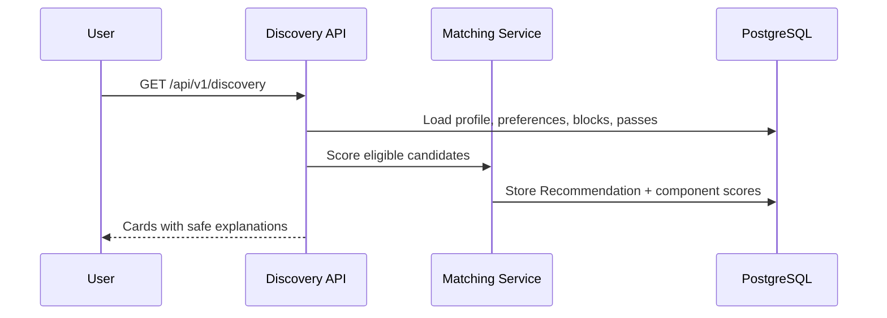
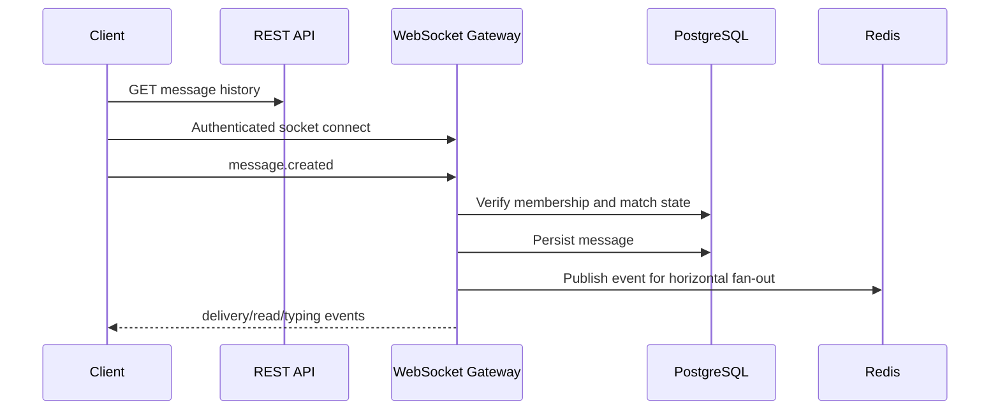
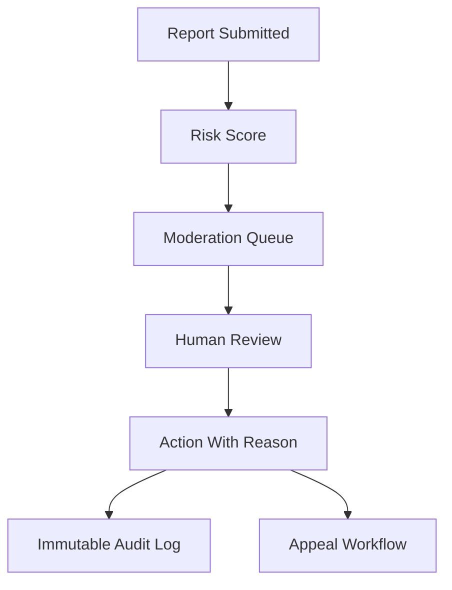
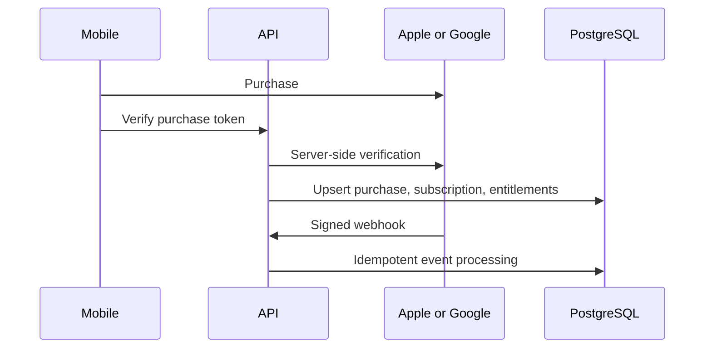
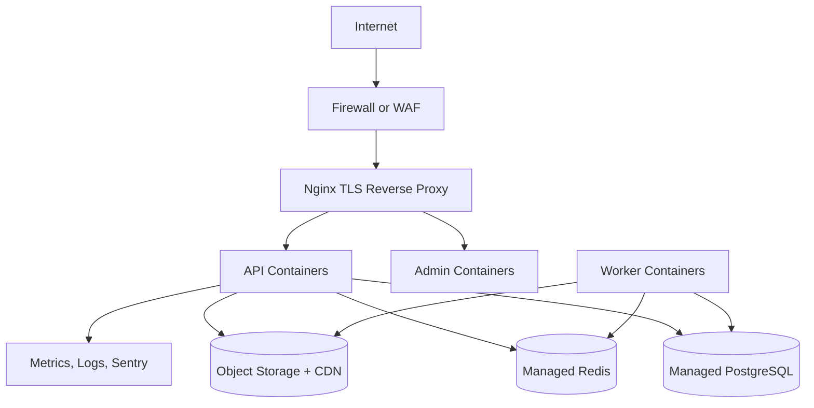

# Sanjari Architecture

## Assumptions

- Sanjari is for adults aged 18+ only.
- Initial deployment is a modular monolith API, not microservices.
- Production uses managed PostgreSQL/PostGIS, managed Redis, S3-compatible object storage, a CDN, and a secrets manager.
- Exact legal text, emergency resources, fraud thresholds, payment accounts, and biometric/identity verification providers require owner and legal approval before launch.
- The first implementation uses explainable rules for matching; no advanced AI claims are made.

## Stable Versions Selected

| Area | Package or Platform | Version | Source Checked |
| --- | --- | ---: | --- |
| Runtime | Node.js | 22.13+ | Expo SDK 57 minimum Node requirement |
| Package manager | pnpm | 11.15.1 | npm latest stable |
| Build system | Turborepo | 2.10.6 | npm latest stable |
| Mobile | Expo SDK | 57.0.0 | Expo SDK reference |
| Mobile | React Native | 0.86 | Expo SDK 57 compatibility table |
| Mobile | React | 19.2.3 | Expo SDK 57 compatibility table |
| API | NestJS | 11.1.28 | npm latest stable |
| Admin | Next.js | 15.5.0 | npm latest stable search result |
| Database ORM | Prisma | 7.9.1 | npm latest stable |

Compatibility choices:

- Expo SDK 57 is selected because Expo marks it as the latest stable SDK and maps it to React Native 0.86, React 19.2.3, and Node 22.13+.
- NestJS 11 is selected because 12.x is alpha and therefore excluded.
- Prisma 7 is selected from the stable `latest` channel; dev and integration tags are excluded.
- Next.js 15.5 is selected from stable npm packages. The admin app uses App Router.
- pnpm 11 and Turborepo 2 are selected because they are current stable releases and support large TypeScript monorepos.

## System Overview



## Monorepo Directory Tree

```text
apps/
  mobile/
  api/
  admin/
packages/
  api-contracts/
  validation/
  types/
  eslint-config/
  tsconfig/
  shared-utils/
infrastructure/
  docker/
  nginx/
  monitoring/
  deployment/
docs/
scripts/
```

## Database Entity Overview

The initial Prisma schema models users, credentials, sessions, profile content, discovery preferences, protected location, likes, passes, matches, conversations, messages, blocking, reports, moderation cases, appeals, risk signals, notifications, subscriptions, payment events, feature flags, experiments, recommendations, support, legal acceptance, data rights requests, admin users, roles, permissions, audit logs, background jobs, and application configuration.

Dynamic business values such as report statuses and moderation states are represented as validated strings so operations can evolve without frequent enum migrations.

## Authentication Design



Access tokens are short-lived JWTs. Refresh tokens rotate on every use and are stored only as hashes. Reuse detection revokes all sessions for the account and records a high-risk signal. The admin portal uses secure, same-site HTTP-only cookies and CSRF protection.

## Security Model

- Backend permissions are enforced with guards using `permissions`, not hidden UI.
- Global validation rejects unknown fields.
- All critical mutations support idempotency keys.
- Object storage uses signed URLs, MIME/type validation, malware scanning hooks, thumbnail generation, and EXIF stripping.
- Logs include request IDs and correlation IDs, but never passwords, OTPs, tokens, private message content, identity documents, or exact GPS coordinates by default.
- Production requires TLS, HSTS, strict CORS, secure headers, secret rotation, and least-privilege database accounts.

## Adult-Age And Verification Design

- Date of birth is collected once during registration/onboarding.
- Age is calculated server-side using UTC calendar comparison.
- Users under 18 are rejected before account activation.
- DOB changes require support review and create an age-validation audit record.
- Suspicious-age reports create high-priority moderation cases and can suspend discovery/messaging.
- Selfie and optional ID verification are provider abstractions. Verification artifacts are private, signed, audited, and retained only for configured periods.

## Matching-System Design



The first ranking version is rules-based with transparent score components: mutual preferences, approximate distance, relationship intention, shared interests, shared languages, lifestyle compatibility, activity recency, profile completeness, verification status, and behavior quality.

## Chat Architecture



REST provides history and recovery. WebSockets provide real-time events. Every event verifies conversation membership on the server.

## Moderation Architecture



High-risk reports are prioritized but not automatically resolved with permanent high-impact actions.

## Subscription Architecture



The mobile app never controls premium status. Entitlements are calculated server-side.

## Deployment Architecture



## Environment Variables

See `.env.example` for the canonical list. Production values must be supplied through a secrets manager.

## Setup Commands

```bash
cp .env.example .env
pnpm install
docker compose up -d
pnpm db:migrate
pnpm db:seed
pnpm dev
pnpm lint
pnpm typecheck
pnpm test
```
